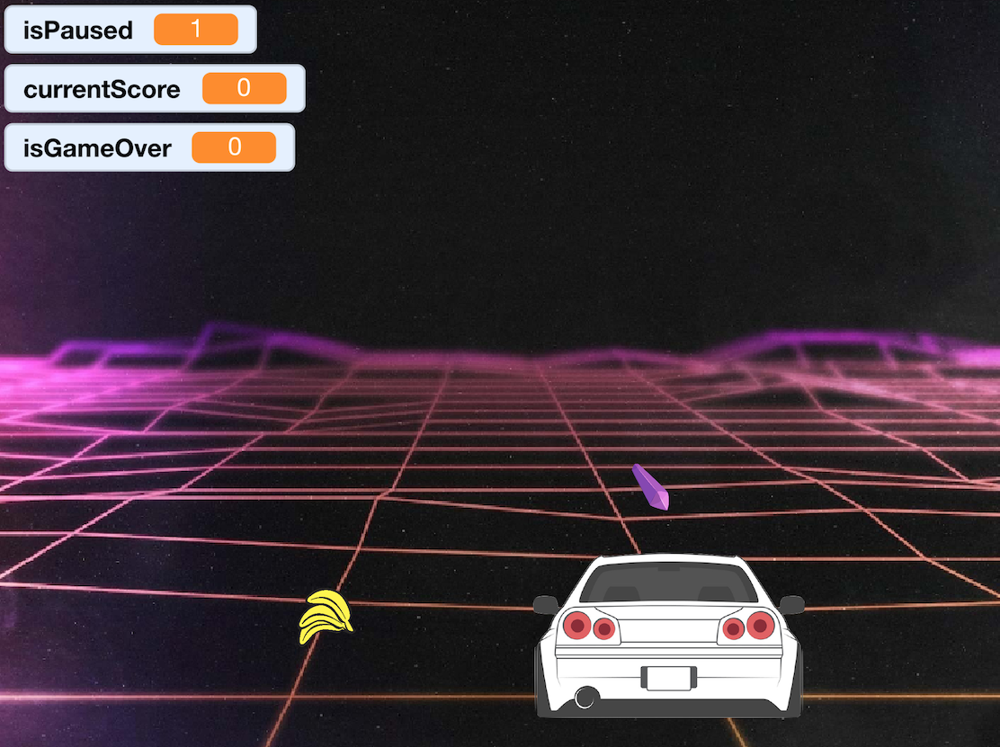

# 🚙 DRIVE - An Arcade Game

Created by **Lorenzo Fossati** based on **[CS50x - Problem Set 0](https://cs50.harvard.edu/x/2020/psets/0/scratch/)**

April 2020

A small arcade-like Scratch ([scratch.mit.edu](https://scratch.mit.edu/explore/projects/all)) driving game.

## Instructions

* Catch the crystals, avoid the bananas
* Move the car using `left arrow` and `right arrow` on the keyboard
* You get **1 point** for every obstacle avoided, and **10 points** for every gem caught
* Press `space` to pause
* Press `r` to reload and start over

## Possible Extension

* Make it more interesting by speeding up or adding more obstacles along the way
* Augment the impression of motion by e.g. moving background and/or rotating the car while turning
